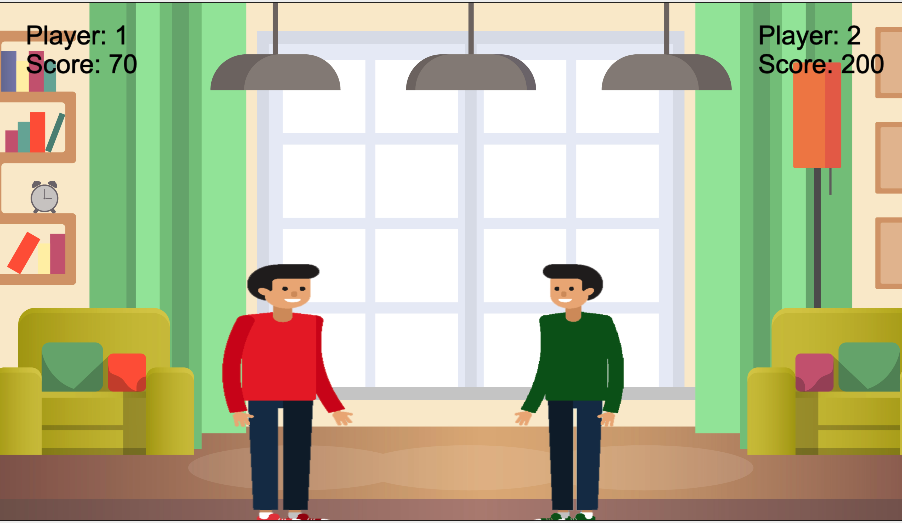

# The Fight Club

 

## Description

As gamers we wanted to create a game that we could play with our friends and share with others so they could play with their friends. We drew inspiration from a simple youtube video that showed how to create a multiplayer game in a browser then to decided to take the multiplayer aspect and make a Mortal Kombat style game. We wanted the ability for players to be able to track their score and save their scores to see who can achieve the highest score out of our friends.

## Table of Contents

- [Installation](#Installation)
- [Usage](#Usage)
- [Instruction](#Instruction)
- [Usage](#Usage)
- [Github/Heroku](#Github/Heroku)
- [License](#License)
- [Screenshots](#Screenshots)
- [Resources](#Resources)
- [Team](#Team)
- [Questions](#Questions)

## Installation

Users will need to clone the repository onto their local computer. Once the repo has been cloned you must use the terminal to install the necessary dependencies and node_modules for the app to work correctly.

## Usage

To use the app you must open the terminal and use the command `node server.js`. Then go into the browser and enter in `localhost:8080`. This will take you to the home page of the app and you can begin playing. You can also use the app with the Heroku link that will be provided in this README.md to use the app and this does not require any cloning or installation of dependencies. 

## Instruction
`"For the best gaming experience, please use Google Chrome"`
- ◄ : Move Left
- ► : Move Right
- ▲ : Guitar Attack
- ⬆SHIFT : Umbrella Attacks

## Github/Heroku

- https://github.com/AtimaB/The-Fight-Club
- https://the-fight-club.herokuapp.com/

## License

- This project uses the following license:  **MIT** 

## Screenshots

## Resources
- [Build a multiplayer game with sockets ](https://www.youtube.com/watch?v=a9rkpvgQUUw&t=414s)
- [Game Canvas](https://www.w3schools.com/graphics/game_canvas.asp)
- [Sound Effects](https://www.zapsplat.com/)
- [Characters](https://www.vecteezy.com/)

## Team
#### Front-End
- Atima Bennett 

#### Back-End
- Yakini Arumuga Kani 
- Collin Hodgson  

## Questions

##### Contact
* [YakiniA](https://github.com/YakiniA)
* [AtimaB](https://github.com/AtimaB)
* [Collin-Hodgson](https://github.com/Collin-Hodgson)
